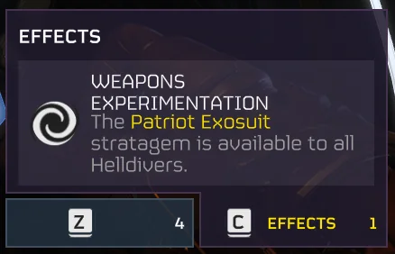
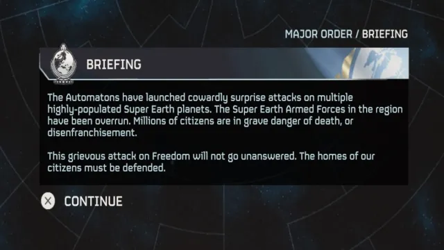

# Global Events Flags

## dictionary
This json contains a dictionary of key: value pairs, representing the globalEvent flag (which correlates to its type) returned from the Helldivers 2 
Status API.

```json
{
	"1": "Stratagem",
	"2": "Briefing",
	"3": "Success",
	"4": "Fail"
}
```
```json
{
  "eventId": 1499087,
  "id32": 0,
  "portraitId32": 0,
  "title": "BRIEFING",
  "titleId32": 2908633975,
  "message": "...",
  "messageId32": 46181626,
  "race": 1,
  "flag": 1, // <-- This one
  "assignmentId32": 2311178494,
  "effectIds": [],
  "planetIndices": []
}
```

### Keys
The key values of the dictionary will be the value that is assigned in the api. In the file you can see that a key of 
`"1"` has been assigned to the value `"Stratagem"`, as that is what is shown in the API.

```json
{
  "1" // <- The key, which corresponds to the integer in the "flag" field above.
}
```

### Values
The value that is mapped to each key is derived from in-game observation. For example, we have derived that the key `"1"`
is `"Stratagem"` as when in-game, the global event was an additional stratagem that became available for everyone ("Weapons Experimentation" / "Open License" effects).

```json
{
  "1": "Stratagem" // <- The value we assigned based off our observations
}
```

As stated above, global events where the value of `flag` is `1` correlate to events where an additional stratagem becomes available for everyone (known as "Weapons Experimentation" / "Open License" effects).

For this kind of global event, the value of `assignmentId32` in the same `globalEvent` object will be the stratagem's internal ID in the game files.



The other 3 values are all Major Order related, and will trigger an in-game "Incoming Transmission from Super Earth" cutscene when interacting with the war map - in which a modal with a title and text (which are taken from the `title` and `message` properties of the `globalEvent` object respectively) will appear. The text that appears above the modal's top right corner will be determined by the value mapped to the flag assigned by the API.

`"Briefing"` (`flag: 2`) events usually happen at the beginning of Major Orders, while `"Success"` (`flag: 3`) and `"Fail"` (`flag: 4`) appear after a Major Order has been completed or has failed, respectively.



The text that will appear above the modal will be equal to the the value of `flag` (in uppercase) prepended to the string `"MAJOR ORDER / "` like this:

```json
{
  "2": "MAJOR ORDER / BRIEFING",
  "3": "MAJOR ORDER / SUCCESS",
  "4": "MAJOR ORDER / FAIL"
}